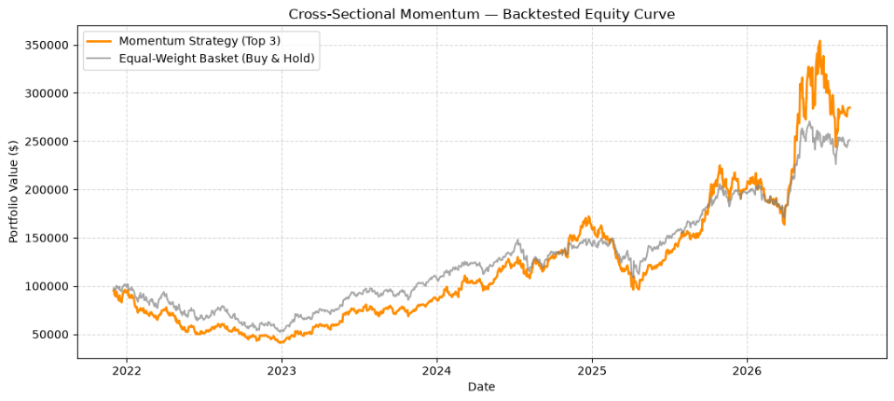
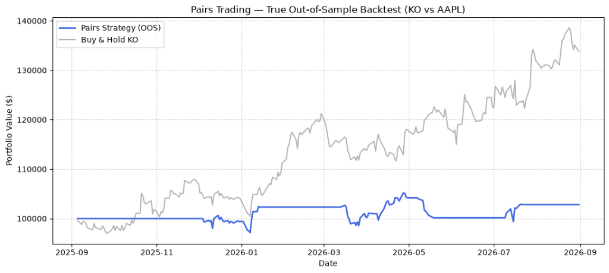

# Multi-Strategy Paper Trading Bot

A multi-strategy quant trading system that allocates capital across three independent strategies and executes on Alpaca's **paper trading** API. Runs automatically once per trading day via GitHub Actions — no server needed.

> ⚠️ This trades on Alpaca's paper (simulated) API, not real money.

## Strategies

| Strategy | Idea | Capital Weight |
|---|---|---|
| Trend Following | 45/90-day MA crossover + RSI filter on a diversified Macro ETF basket (SPY, QQQ, GLD, TLT) | 30% |
| Pairs Trading | Sector-clustered cointegration scan (Semiconductors, Big Tech, Financials), mean-reversion on the spread z-score | 25% |
| Cross-Sectional Momentum | Dynamically scrapes the Nasdaq-100 universe, ranks by 63-day return, holds the top 5 fractionally | 30% |

15% of equity is held back as a cash buffer.

## Backtest results

| Strategy | Annualized Return | Sharpe Ratio | Max Drawdown | Win Rate | Date Range |
|---|---|---|---|---|---|
| **Trend Following (Macro)** | 6.4% | 0.73 | -12.4% | 54.5% | 5-Year Period |
| **Pairs Trading (Sector)** | 10.3% | 0.78 | -12.4% | 50.0% | OOS Period |
| **Momentum (Nasdaq-100)** | 30.8% | 0.81 | -52.9% | 52.9% | 5-Year Period |

*(Note: These are actual backtest metrics extracted directly from the research models.)*

### Equity Curves

**Cross-Sectional Momentum (Nasdaq-100)**


**Pairs Trading (Out-of-Sample)**



## Architecture

- **Stateless Portfolio Engine**: Calculates a target net-exposure dictionary for the entire portfolio, compares it to actual holdings, and automatically nets out overlaps to submit precise `BUY/SELL` delta orders.
- **Fractional Shares**: Every dollar of budget is efficiently deployed using fractional share execution precision.
- `master_pipeline.py` — Entrypoint; pulls account equity, allocates budget, evaluates all 3 strategies, and executes the delta via Alpaca using `DAY` orders.
- `.github/workflows/trade.yml` — GitHub Actions cron job that runs the pipeline every weekday at 10:00 AM EDT.
- Market data is pulled directly from Alpaca's API (IEX data feed).
- Secrets (`ALPACA_API_KEY`, `ALPACA_SECRET_KEY`) are stored as encrypted GitHub Actions secrets, never committed to the repo.

## Known limitations

- The pairs-trading cointegration scan tests pairs at p < 0.05. While "sector-clustering" (grouping by industry) heavily reduces spurious correlation, false positives are still possible without strict multiple-comparisons correction (e.g., Benjamini-Hochberg).
- No per-position stop-loss beyond the pairs strategy's z-score exit and the moving average signal flips.
- Relying on Wikipedia HTML for the Nasdaq-100 constituent list could break if the Wikipedia page structure changes heavily, though a robust fallback list is implemented.

## Running locally

```bash
pip install -r requirements.txt
# Create a keys.env file and fill in your Alpaca paper keys
python master_pipeline.py
```
